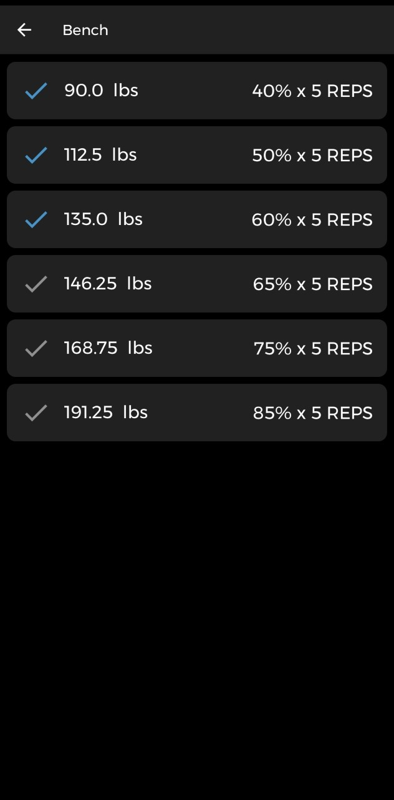

# BlackBook Strength
BlackBook Strength is an Android application designed mainly for people that
train using the 5 3 1 powerlifting philosophy. It is a place to track your
progress and calculate your next lifts. BlackBook Strength, among other
features, also gives the user the ability to add assistance exercises,
input their daily goal for calories and weightins — and also track them.

## App Screenshots
The BlackBook Strength Android app contains the following areas:

1. Login Page

2. Register Page

3. Reset Password functionality (in case you need it)

4. Lift

5. Lift List

6. A Calorie Log

7. A Weight Log

8. Your Profile, settings and preferences reside here

